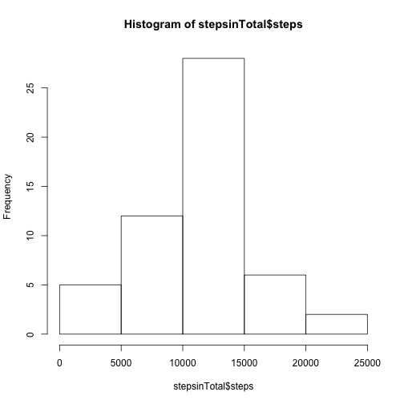
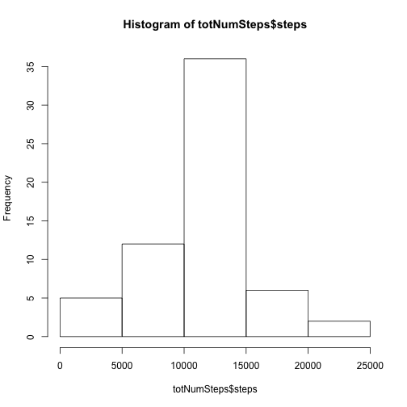

Peer Assessment 1 - Reproducible Research
========================================================

#### Set the Global setting for command echo to be displayed

```r
opts_chunk$set(echo = TRUE)
```

## Loading and preprocessing the data

#### Load the Activity.csv data into R

```r
actData <-read.csv("activity.csv")
```

#### Transform the data for missing values to prepare to be analyzed

```r
stepsinTotal <- aggregate(steps~date,data=actData,sum,na.rm=TRUE)
```

## What is mean total number of steps taken per day?
#### Histogram of the total number of steps taken each day

```r
hist(stepsinTotal$steps)
```

 

#### Mean and Median - echoing the calculations and the values

```r
mean(stepsinTotal$steps)
```

```
## [1] 10766
```

```r
median(stepsinTotal$steps)
```

```
## [1] 10765
```

The **Mean** of the total steps taken per day were **1.0766 &times; 10<sup>4</sup> steps**.
The **Median** of the total steps taken per day were **10765 steps**.

## What is the average daily activity pattern?

#### Time series plot (i.e. type = "l") of the 5-minute interval (x-axis) and the average number of steps taken, averaged across all days (y-axis)


```r
intervalofSteps<-aggregate(steps~interval,data=actData,mean,na.rm=TRUE)
plot(steps~interval,data=intervalofSteps,type="l")
```

 

#### 5-minute interval, on average across all the days in the dataset, that contains the maximum number of steps

```r
intervalofSteps[which.max(intervalofSteps$steps),]$interval
```

```
## [1] 835
```
Answer: Interval number: **835**.

## Imputing missing values

#### Calculate and report the total number of missing values in the dataset (i.e. the total number of rows with NAs)

```r
sum(is.na(actData$steps))
```

```
## [1] 2304
```
The total number of rows with NAs: **2304**

#### Fill in all of the missing values in the dataset. We use the mean for that 5-minute interval for our solution.

```r
intofstepsfivemin<-function(interval) {
    intervalofSteps[intervalofSteps$interval==interval,]$steps
}
```

#### Create a new dataset that is equal to the original dataset but with the missing data filled in

```r
actDatawithNAs <- actData   # Load original dataset into memory for filling the NAs 
count=0           # Iniitialize Counter
for(i in 1:nrow(actDatawithNAs)){
    if(is.na(actDatawithNAs[i,]$steps)){
        actDatawithNAs[i,]$steps<-intofstepsfivemin(actDatawithNAs[i,]$interval)
        count=count+1
    }
}
cat(count, "missing values were filled.\n\r")
```

```
## 2304 missing values were filled.
## 
```

#### Make a histogram of the total number of steps taken each day and Calculate and report the mean and median total number of steps taken per day. Do these values differ from the estimates from the first part of the assignment? What is the impact of imputing missing data on the estimates of the total daily number of steps?


```r
totNumSteps <- aggregate(steps~date,data=actDatawithNAs,sum)
hist(totNumSteps$steps)
```

 

```r
mean(totNumSteps$steps)
```

```
## [1] 10766
```

```r
median(totNumSteps$steps)
```

```
## [1] 10766
```

The **Mean** of the total steps taken per day were **1.0766 &times; 10<sup>4</sup> steps**.
The **Median** of the total steps taken per day were **1.0766 &times; 10<sup>4</sup> steps**.

## Are there differences in activity patterns between weekdays and weekends?

#### Create a new factor variable in the dataset with two levels – “weekday” and “weekend” indicating whether a given date is a weekday or weekend day.


```r
actDatawithNAs$day=ifelse(as.POSIXlt(as.Date(actDatawithNAs$date))$wday%%6==0,"weekend","weekday")
# "weekend" denotes a Sunday and Saturday.
# "weekday"" denotes rest of the days of the week. 
actDatawithNAs$day=factor(actDatawithNAs$day,levels=c("weekday","weekend"))
```

#### Make a panel plot containing a time series plot (i.e. type = "l") of the 5-minute interval (x-axis) and the average number of steps taken, averaged across all weekday days or weekend days (y-axis). The plot should look something like the following, which was creating using simulated data:


```r
intervalSteps=aggregate(steps~interval+day,actDatawithNAs,mean)
library(lattice)
xyplot(steps~interval|factor(day),data=intervalSteps,aspect=1/2,type="l")
```

 


